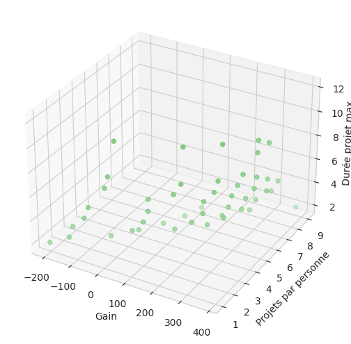
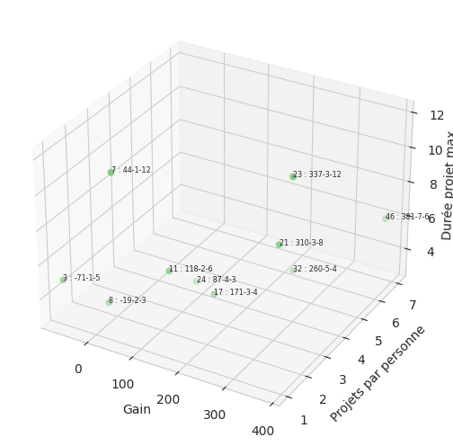
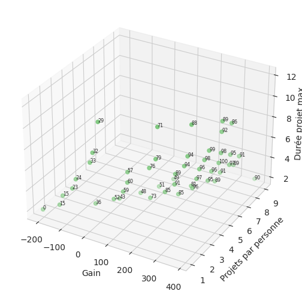
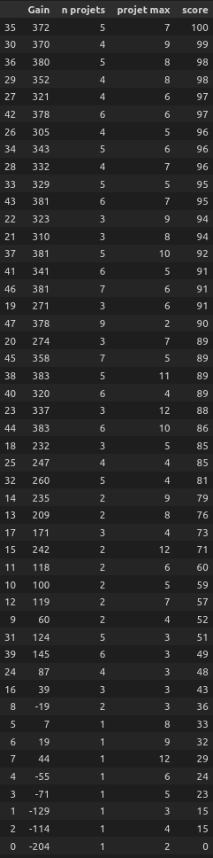
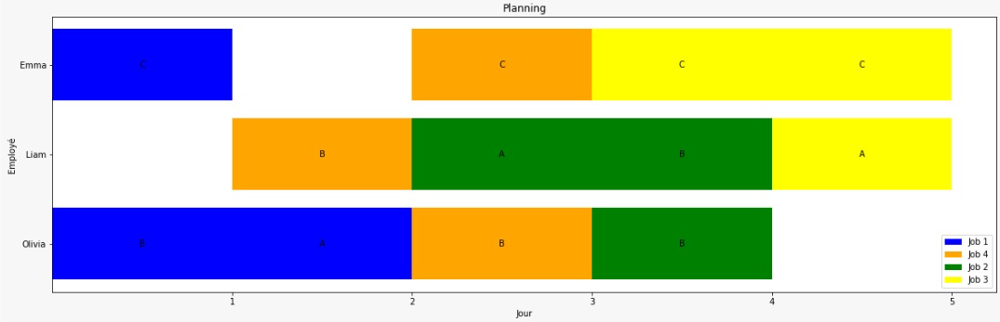
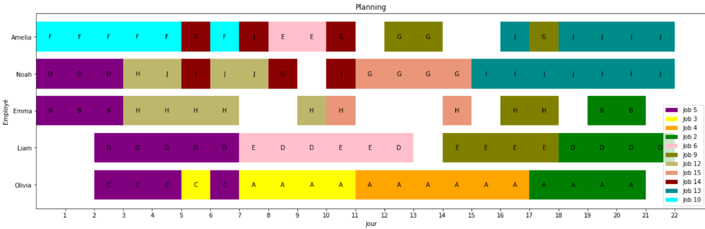
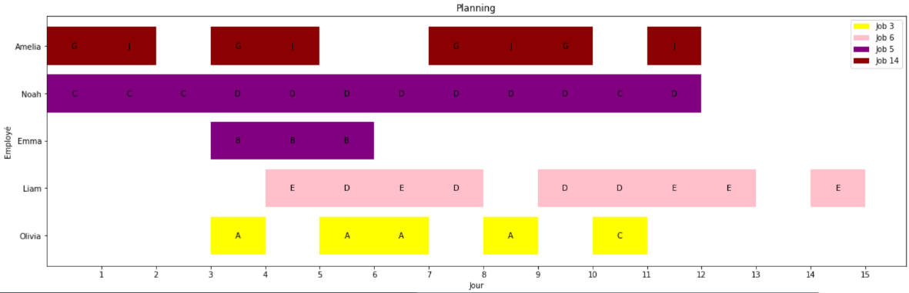
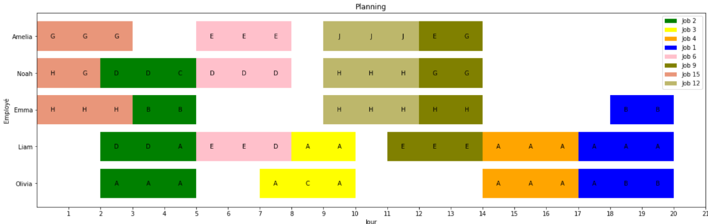

# Modélisation

### Membres équipe

Antoine RULLIER, Alexandre GAUTIER, Corentin PUJOL

### Introduction :

L’objectif de ce projet est de construire un planning affectant des travailleurs possédants certaines compétences à certains jobs dans le but de maximiser le gain perçu en les complétant. Pour cela, il va falloir répondre à certaines contraintes rigides (comme les jours de vacances des employés, le nombre de jours dont on dispose) et d’autres plus souples (comme les dates de rendu des projets qui implique une pénalité sur le gain).

### Données de l’énoncé :

- **horizon** : Le nombre de jours disponibles pour travailler
- **staff** : La liste des travailleurs avec leur nom, leur compétences et leurs jours de vacances
- **jobs** : La liste des jobs avec leur nom, leurs compétences requises, le gain qu’ils rapportent une fois complétés et leur date de rendu avec leur pénalité

### Termes

On définit ensuite les termes suivant (donnés avec leurs définitions par contraintes) :

- $N_{j, c}$ : le nombre de jours de travail de compétence $c$ que le job $j$ nécessite (pas une variable de décision)
- $T_{e, c, d, j}$ : variable binaire valant 1 si l’employé $e$ travaille sur la compétence $c$ sur le job $j$ au jour $d$, 0 sinon

- $days\_worked\_on\_job_{e, j}$ : variable entière quantifiant le nombre de jours de travail de l’employé
  
    $\forall e, \forall j , \ days\_worked\_on\_job_{e, j} = \Sigma_{c, d} T_{e, c, d, j}$
    
- $has\_worked_{e, j}$ : variable binaire valant 1 si l’employé $e$ a travaillé sur le job $j$
  
    $\forall e, \forall j , \ has\_worked_{e, j} = min(1, days\_worked\_on\_job_{e, j})$
    
- $has\_worked\_sum_{e}$ : variable entière quantifiant le nombre de jobs sur lequel l’employé $e$ a travaillé
  
    $\forall e, has\_worked\_sum_e = \Sigma_j has\_worked_{e,j}$
    
- $max\_has\_worked$ : variable entière quantifiant le nombre de jobs maximum sur lequel un employé travaille
  
    $max\_has\_worked = max_e(has\_worked\_sum_e)$
    
- $worked_{j, d}$ : variable binaire valant 1 si du travail a été fourni sur le job $j$ au jour $d$
  
    $\forall j, \forall d, worked_{j, d} = min(1, \Sigma_{e, c} T_{e,c,d,j})$
    
- $still\_work\_to\_do_{j, d}$ : variable binaire valant 1 si du travail va encore être effectué sur le job $j$ après le jour $d$
  
    $\forall j, still\_work\_to\_do_{j, d} = max_{day>d}(worked_{j,day})$
    
- $something\_done\_yet_{j,d}$ : variable binaire valant 1 si du travail a déjà été effectué sur le job $j$ au jour $d$
  
    $\forall j, something\_done\_yet_{j, d} = max_{day\leq d}(worked_{j,day})$
    
- $end\_dates_j$ : variable entière quantifiant le dernier jour où du travail a été fourni sur le job $j$ (0 si aucun travail n’a été fourni)
  
    $\forall j, end\_dates_j = \Sigma_d still\_work\_to\_do_{j, d}$
    
- $start\_dates_j$ : variable entière quantifiant le premier jour où du travail a été fourni sur le job $j$ ($horizon$ si aucun travail n’a été fourni)
  
    $\forall j, start\_dates_j = horizon - \Sigma_d still\_work\_to\_do_{j, d} + 1$
    
- $job\_lens_j$ : variable entière quantifiant la durée du job $j$ (négative si aucun travail n’a été effectué)
  
    $\forall j, job\_lens_j = end\_dates_j - start\_dates_j + 1$
    
- $max\_job\_len$ : variable entière quantifiant la durée maximale des jobs effectués
  
    $max\_job\_len = max_j(job\_lens_j)$
    
- $all\_J_{j,c}$ : variable binaire valant 1 si le job $j$ est fini par rapport à la compétence $c$
  
    $\forall j, \forall c, \ M_c * (all\_J_{j,c} - 1) \leq \Sigma_{e,d} T_{e,c,d,j} - N_{j,c} < M_c * all\_J_{j,c}$ avec $M_c$ un majorant de $all\_J_{j,c}$
    
- $all\_J_{j}$ : variable binaire valant 1 si le job $j$ est complètement fini
  
    $\forall j, all\_J_{j} = min_c(all\_J_{j,c})$
    
- $retard_j$ : variable entière quantifiant le retard sur la livraison du job $j$ par rapport à sa $due\_date$
  
    $\forall j, retard_j = max(0, end\_dates_j - due\_date_j)$
    
- $gains_j$ : variable entière quantifiant le gain rapporté par le job $j$
  
    $\forall j, gains_j = all\_J_j * (gain_j - daily\_penalty_j * retard_j) - (1-all\_J_j) * daily\_penalty_j * (horizon - due\_date_j)$
    
    Dans notre modélisation, *CompuOpti* a accepté tous les projets et se prend donc une pénalité pour chaque projet non effectué. Si l’on voulait que la société soit libre de refuser des projets, ils suffirait de supprimer le deuxième terme dans la définition de nos gains.
    
- $gain\_total$ : variable entière quantifiant le gain total
  
    $gain\_total = \Sigma_j gains_j$
    

### Liste des contraintes

1. Un employé ne peut être affecté à une qualification d’un job que s’il possède cette qualification. 
2. Un employé ne peut pas être affecté à un job un jour de congé (contrainte de congé).
3. Un employé ne peut travailler sur un job avec une compétence donnée si ce job ne requiert pas cette compétence.
   
    *Ces trois contraintes ont directement été prises en compte dans la création de la variable de décision $T$ grâce à une tuple list bien définie*
    
4. A tout instant, un employé ne peut être affecté qu’à un seul job et qu’à une seule qualification intervenant dans ce job (contrainte d’unicité de l’affectation quotidienne du personnel).
   
    $\forall e, \forall d,\ \Sigma_{c, j} T_{e, c, d, j} <= 1$
    
5. On ne travaille pas sur un job déjà fini, et on ne travaille pas sur un job qu’on ne finit pas :
   
    $\forall j, \ \Sigma_{e,c,d} T_{e,c,d,j} \leq all\_J_j * \Sigma_c N_{j,c}$
    

### Liste des critères (fonctions objectifs)

1. En premier lieu, il s’agit de maximiser le résultat financier de l’entreprise et donc de constituer un planning qui conduit à maximiser le bénéfice (incluant d’éventuelles pénalités).
   
     $maximize(gain\_total)$
    
2. On souhaite que les collaborateurs n’aient pas  à changer trop souvent de projet et, pour ce faire on s’attachera à minimiser le nombre de projets sur lesquels un quelconque collaborateur est affecté. 
   
    $minimize(max\_has\_worked)$
    
3. Il est important que les projets soient réalisés dans un nombre limités de jours consécutifs, ainsi on cherchera pour cela à exécuter le projet le plus long en un minimum de jours.
   
    $minimize(max\_job\_len)$
    

### Calcul de la surface de Pareto

Pour obtenir la surface de Pareto, nous avons implémenté d’abord obtenu tous les triplets de solution (gain, nombre de projets max par employé, durée max d’un projet) en fixant les deux derniers termes selon toutes leurs valeurs possibles et en maximisant à chaque fois le gain. Une fois ces triplets obtenus, il suffit de les filtrer et d’éliminer ceux étant dominés par une autre solution.

Pour des raisons de capacité de calculs, nous avons du donner une limite de temps au solveur pour chacune de ses maximisations du gain sur l’instance moyenne. Nous ne pouvons donc pas assurer avec certitude que la surface obtenue est optimale, mais elle s’en rapproche néanmoins.

Surface de Pareto pour l’instance moyenne

## Classification

Afin de classifier nos solutions non dominées, nous avons décidée de faire classer au décideur un sous échantillon de 10 de nos solutions. A chaque solution du sous échantillon, le décideur devra attribuer un score numérique en prenant en compte les écarts entre les scores. Plus le décideur aura le temps de classer un grand nombre d’échantillon, meilleurs seront les résultats. 

Puis nous entrainons un modèle linéaire (3 poids un biais) afin d’extrapoler le classement du décideur à toutes les solution de la surface de Pareto précédemment calculées. Le modèle est donc entrainé ici sur le 10 solutions classée par le décideur, chaque une étant composée du triplet (Gain, Nombre de projets par personne, Projet le plus long) associée à un score numérique choisis par le décideur.

Sous échantillon de 10 solutions non dominée annoter avec → id : gain, n projet, durée. Cette visualisation est censé permettre au décideur de faciliter le classement des solutions.

Toutes les solutions de la surface de Pareto accompagnée des scores inférés par le modèle linéaire.

Classement des solution par les scores inférés par le modèle linéaire.

Le modèle linéaire a été entrainé sur des données normalisées avec l’optimiseur Adam, un taux d’apprentissage adaptatif et initialisé à 0.01 sur 10 000 itérations avec des batchs de 10. Les scores inférés par le modèle ont été normalisé à postériori pour s’étaler entre 0 et 100.

La tableau des scores nous montre les résultats de l’inférence du modèle sur l’instance moyenne. Il permet au décideur de choisir les solutions qui lui paraissent les plus appropriées, si la 1ère ne convient pas.

## Résultats

Pour l’instance Toy, la solution optimale est (gain = 64, projets max par staff = 3, durée max d’un projet = 2). Voici un planning correspondant à cette solution :

Pour l’instance Medium, la solution que notre modèle choisit comme optimale est (gain = 372, projets max par staff = 5, durée max d’un projet = 7). Voici un planning correspondant à cette solution :

Si l’on souhaite que chaque employé travaille au plus sur un seul projet, le gain maximal obtenable est alors de 44 (pour une durée maximale de projet de 12). Voici un planning correspondant :

Dans le cas où nous souhaitons terminer chaque projet en moins de 3 jours, le gain maximal obtenable est alors de 145 pour un nombre de projets maximal par employé de 6.

